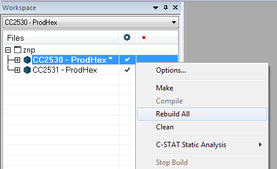

# CC2530 + CC2591|RFX2401 coordinator firmware
1. Open `Z-Stack Home 1.2.2a.44539\Projects\zstack\ZNP\CC253x\znp.eww` with IAR Embedded workbench for 8051.
2. You will get a warning: *The project file 'CC253(0/1).ewp' is in an old format. Would you like to convert it for use with this version?*. Press **yes** for both.
3. In the dropdown, set target to *CC2530 - ProdHex*.
4. Right-click on *CC2530 - ProdHex** and press options. Go to C/C++ compiler -> preprocessor. Change the *Defined symbols* to:
```
ASSERT_RESET
FAKE_CRC_SHDW
TC_LINKKEY_JOIN
SECURE=1
INTER_PAN
HAL_PA_LNA
```
6. Press OK.
7. Right-click on *CC2530 - ProdHex** and click *Rebuild all*.

8. Once finished, you can find the `CC2530ZNP-Prod.hex` file in `Z-Stack Home 1.2.2a.44539\Projects\zstack\ZNP\CC253x\dev`.
You can rename it to 'CC2530_CC2591ZNP-Prod.hex' to not confuse it with the file for the cc2530 without amplifiers.

