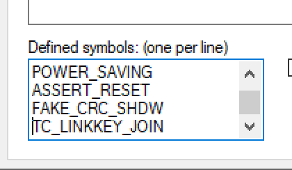

# CC2531 coordinator firmware
1. Open `Z-Stack Home 1.2.2a.44539\Projects\zstack\ZNP\CC253x\znp.eww` with IAR Embedded workbench for 8051.
2. You will get a warning: *The project file 'CC253(0/1).ewp' is in an old format. Would you like to convert it for use with this version?*. Press **yes** for both.
3. In the dropdown, set target to *CC2531 - ProdHex*.

4. Right-click on *CC2531 - ProdHex** and press options. Go to C/C++ compiler, preprocessor and in *Defined symbols* change `xTC_LINKKEY_JOIN` to  `TC_LINKKEY_JOIN`. Press OK.

5. Open *CC2531 - ProdHex** -> `NWK/nwk_globals.h` and change:
```c
#define NWK_MAX_DEVICE_LIST 20
```
to
```c
#define NWK_MAX_DEVICE_LIST 25
```
6. Open *CC2531 - ProdHex** -> `ZMain/OnBoard.h` and change:
```c
#if defined TC_LINKKEY_JOIN
#define MAXMEMHEAP  2170
#else
```
to
```c
#if defined TC_LINKKEY_JOIN
#define MAXMEMHEAP  2827
#else
```
7. Right-click on *CC2531 - ProdHex** and click *Rebuild all*.
8. Once finished, you can find the `CC2531ZNP-Prod.hex` file in `Z-Stack Home 1.2.2a.44539\Projects\zstack\ZNP\CC253x\dev`.

